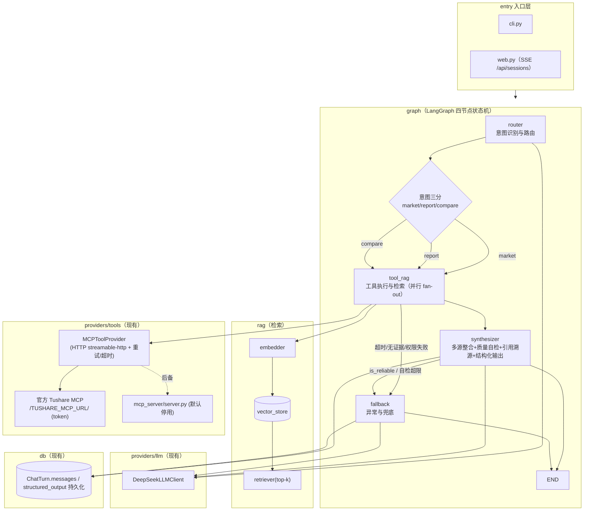
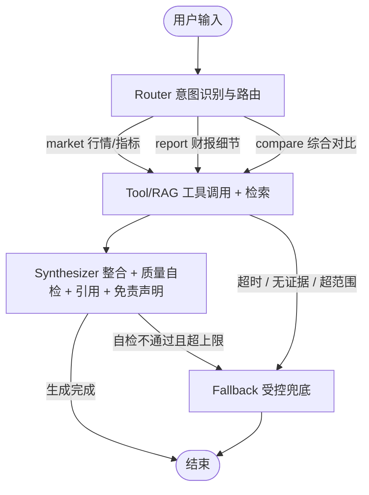
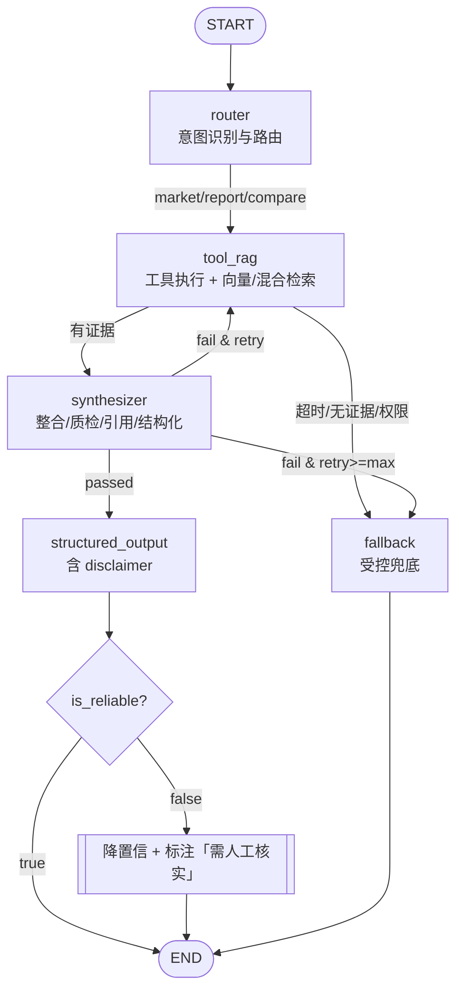

# 总体架构文档：基于 LangGraph 的四节点状态机

> 本文档描述 `demo-mcp`（`D:\TushareAgent`）的**目标架构**：在现有「LLM + MCP 数据对话助手」之上，把编排从手动 agentic loop 升级为 **LangGraph** 状态图，引入 **RAG 检索** 与 **结构化输出**，形成一条「**用户输入 → 意图识别与路由（Router）→ 工具执行与检索（Tool/RAG，并行）→ 投研生成与格式化（Synthesizer，引用 + 免责声明）→ 异常/兜底（Fallback）**」的四节点流水线。
>
> 本文为**演进中设计**：`demomcp/graph`（LangGraph 四节点：router / tool_rag / synthesizer / fallback）与 `demomcp/rag` 空实现（`NullRetriever`，无向量库/语料）已落地；**质量自检回环 / verify_reasonableness、真实 RAG（embedder/vector_store/ingest）未接入**。文中标注「**现有**」的构件可在真实代码中找到对应实现；标注「**ADD**」的构件为待落地组件。本文不写实现代码，仅给出设计蓝图。

---

## 1. 概述与目标

### 1.1 项目定位

`demo-mcp` 是一个独立运行的数据对话助手：用户用自然语言提问，内置智能体决定调用哪个 MCP 工具、经 MCP client 以 HTTP(streamable-http) 连接 **Tushare 官方 MCP**（`settings.tushare_mcp_url`，默认 `TUSHARE_MCP_URL`，如 `https://api.tushare.pro/mcp/?token=...`），由 MCP 取数（工具运行时自动发现），再总结成中文回答。当前提供 CLI 与 SSE Web 两个入口，并用 SQLAlchemy 持久化会话历史。

现有分层严格、依赖单向：

```
interfaces  类型 + ToolProvider / LLMClient 两协议（纯契约，无实现）
agents      Agent 手动 agentic loop + 工具注册（只依赖 interfaces）
providers   tools: mcp/fake；llm: deepseek/mock —— 可插拔适配器
config      Settings + PROJECT_ROOT（含 tushare_mcp_url 等 MCP 连接配置、RAG/图/免责声明配置）
db          SQLAlchemy 2.0 异步：ChatMessage（可读日志）+ ChatTurn（精确恢复）
entry       cli.py / web.py（SSE 流式 + /api/sessions）
mcp_server  内置数据 MCP server（默认停用，仅后备；本地/离线代理用）
```

### 1.2 为什么转向 LangGraph

手动循环（`demomcp/agents/agent.py` 的 `Agent.run`）在「调用 LLM → 执行工具 → 回填消息」之间线性往复，天然适合单 agent、顺序工具链的场景。但当我们需要：

- **意图分流**：先识别用户意图（纯行情/指标、财报细节、综合对比），再决定走哪套取数与检索策略；
- **并行两路取数**（工具调用 + RAG 检索同时进行）而不是顺序串行；
- **多源汇聚与冲突检测**，并在生成前做一次**质量自检**；
- **受控兜底**：工具超时、无匹配证据、超出标的范围时，走独立的 Fallback 分支而不是硬失败；
- 在每一步结束后可**持久化检查点**、可**观测**、可**精确恢复**；

线性 `for` 循环就难以优雅表达。LangGraph 的 **`StateGraph`** 将流程建模为显式状态图：节点（nodes）各司其职、条件边（conditional edges）决定分支/回环/终止、`State` 在节点间流转、`checkpointer` 支持可恢复性。它把这些控制流「数据化」，便于并行与进化。

### 1.3 目标能力

| 能力 | 说明 |
|---|---|
| 意图路由 | 识别「纯查行情/指标 / 财报细节检索 / 综合对比分析」三类意图，分别路由到相应的取数与检索策略 |
| 多源佐证 | 同一结论同时由「结构化数据工具」与「非结构化知识文档」支撑 |
| 可溯源 | 每条声明（Claim）关联具体证据与引用（工具来源 / 文档块 ID） |
| 结构化输出 | 最终返回带置信度、引用、可靠性标记、**免责声明**的结构化答案 |
| 受控兜底 | 工具超时 / 无匹配证据 / 超出标的范围时，走 Fallback 输出受控响应，不崩图、不编造 |

---

## 2. 现状 vs 目标

下表把现有手动 loop 的每个构件映射到 LangGraph 四节点（详细复用见第 12 节）。

| 现有实现（manual loop） | LangGraph 等价物 | 位置（现有） |
|---|---|---|
| `Agent.run` 的 `for _ in range(max_iterations)` | `StateGraph` 循环边 + `RecursionLimit` / 次数守卫 | `agents/agent.py:44` |
| `llm.chat(messages, tools, system, …)` | **Router / Synthesizer 的 LLM 调用节点**（`model.bind_tools` + `invoke`） | `agents/agent.py:45-53` |
| `assistant_message(resp)` 无条件追进 history | `State["messages"]` 用 `add_messages` reducer 追加 | `agents/agent.py:59` |
| `stop_reason in {end_turn, max_tokens, refusal}` → 返回 | 条件边路由到 **`END`**（终止节点） | `agents/agent.py:61-66` |
| `not resp.tool_uses` → `no_progress` 返回 | 条件边：无工具调用且非终止 → 终止（`no_progress`） | `agents/agent.py:67-68` |
| `for tu in resp.tool_uses: _safe_call_tool(...)` | **Tool/RAG 节点**（LangGraph 支持并行工具执行 + RAG 检索） | `agents/agent.py:70-77` |
| `tool_results_messages(pairs)` 回填 | `add_messages` 追加 `ToolMessage`（`role=tool`，`tool_call_id`） | `agents/agent.py:76` |
| `_safe_call_tool` 吞异常转 `is_error` | 工具节点内 try/except → 错误 `ToolMessage`，不崩图；超时/无证据走 Fallback | `agents/agent.py:86-90` |
| `text_parts` 累积 → `final_text` | `State["structured_output"]` 由消息内容 reduce 拼接 | `agents/agent.py:40,56,100` |
| `results` / `usage` 累积 | `State["tool_evidences"]`、`State["usage"]` | `agents/agent.py:41,54,77` |
| `CompositeToolProvider`（registry） | `ToolNode` / `StructuredTool` 工具集，按名分发 | `agents/registry.py` |
| `on_text` / `on_thinking` 流式回调 | `StreamMode="messages"` / `astream_events` 逐 token 流式 | `interfaces/llm_client.py` |
| `on_tool` 回调（思考轨迹） | Tool/RAG 节点结果 introspection / 回调 / `checkpointer` | `agents/agent.py:74-75` |
| `AgentResult.messages` 由调用方落库 | `checkpointer`（`InMemorySaver` / `SqliteSaver`）保存整段 state | `cli.py:84` `web.py:111` |

**迁移时需特意保留两点语义：**

1. **`end_turn` 与 `no_progress` 是可区分的两条终止路由** —— `no_progress`（`stop_reason` 非终止且无工具调用）需要独立的条件边，不能简化为「无工具调用 → END」。
2. **错误永不崩图** —— LangGraph 没有 `is_error` 字段，必须把 `_safe_call_tool` / provider 层吞异常的模式搬进每个工具节点：内部 try/except，退出时返回错误 `ToolMessage`（内容含 `Error calling …`）；当**超时 / 无匹配证据 / 超范围**时走 Fallback 分支，而不是抛异常让整图中断。

---

## 3. 总体架构图（分层）

在原分层层上**新增**两层：`graph`（LangGraph 编排，四节点）与 `rag`（检索）。其余层复用，不改依赖方向。

```
entry         cli.py / web.py（SSE 流式 + /api/sessions）
graph   ▲新建  StateGraph 编排：router / tool_rag / synthesizer / fallback + 条件边 + 检查点
rag     ▲新建  向量检索：embedder / vector_store / retriever / ingest
agents        （现有手动 loop 作为可弃用实现保留；工具注册复用 registry）
interfaces    类型 + ToolProvider / LLMClient 协议（纯契约）
providers     tools: mcp / fake（复用现有）；llm: deepseek / mock
config        Settings + PROJECT_ROOT（新增 RAG/图/免责声明配置落点）
db            ChatMessage + ChatTurn（检查点/结构化输出落库可扩展）
mcp_server    内置 MCP server（默认停用，仅后备）
```



> 说明：`router` / `synthesizer` / `fallback` 需要 LLM 能力，故指向 `DeepSeekLLMClient`；`tool_rag` 只做工具调用与向量/混合检索（检索不生成），若需对 RAG chunk 重排可再引 LLM（此处从简）。

---

## 4. 图拓扑与流程图

### 4.1 主流程图（用户口径）



### 4.2 条件边说明

| 从 → 到 | 条件 | 备注 |
|---|---|---|
| `Router → Tool/RAG` | 恒真；按 `intent` 路由 | `market/report/compare` 三类意图各自的 `retrieval_plan`（工具集 + 检索概念 + 过滤条件）不同 |
| `Tool/RAG → Tool/RAG` 内 | 并行 fan-out + join | 工具调用与 RAG 检索同时进行，无先后依赖；产出统一进 `evidence` |
| `Tool/RAG → Synthesizer` | 恒真（有证据） | 两路产出就绪即进入整合 |
| `Tool/RAG → Fallback` | 工具超时 / 无匹配证据 / 权限类失败 | 无可用证据即可终止（受控兜底），不继续生成 |
| `Synthesizer → END` | 生成完成 | `is_reliable=true`（或降置信但明确标注） |
| `Synthesizer → Fallback` | 质量自检不通过且超过重试上限 | 兜底输出 `is_reliable=false` + 免责声明，而非抛出 |
| `Synthesizer → Synthesizer`（内部自检） | 自检不通过且 `retry_count < SYNTH_MAX_RETRY` | 受控回环：定向修正（换参数/扩时间/降冲突权重），用 `RecursionLimit` 兜底 |

> **兜底语义**：达到重试上限仍不通过、或根本无证据/超范围时，走 **Fallback** 输出**降置信**结果，在答案中显式标注「需人工核实」/「超出范围 / 无法取到」并附免责声明，而不是给出未经校验的强结论。

---

## 5. State 状态设计（LangGraph State）

`StateGraph` 的 `State` 用 `TypedDict`（或 Pydantic）声明，跨节点流转、由节点以增量方式更新（`Annotated[list, add_messages]` 走 reducer）。关键字段如下：

| 字段 | 类型 | reducer / 说明 | 写入节点 |
|---|---|---|---|
| `messages` | `Annotated[list[BaseMessage], add_messages]` | 对话上下文（含用户/助理/工具消息） | Router、Synthesizer |
| `original_query` | `str` | 用户原始输入 | 入口 |
| `intent` | `"market" \| "report" \| "compare"` | 路由后的意图分类 | Router |
| `retrieval_plan` | `{tools: [...], concepts: [...], filters: {...}}` | 该意图的「该调哪些工具、该检索哪些概念、过滤条件」计划（含改写后查询） | Router |
| `tool_evidences` | `list[Evidence]` | 工具调用产生的结构化证据 | Tool/RAG |
| `rag_chunks` | `list[RagChunk]` | RAG 命中文档块（含元数据） | Tool/RAG |
| `evidence` | `list[Evidence]` | **整合后**的统一证据集（去重、冲突标记） | Synthesizer |
| `claims` | `list[Claim]` | 基于证据的候选声明 | Synthesizer |
| `verification` | `VerificationResult` | 质量自检结论（`passed` + 原因列表） | Synthesizer（自检） |
| `citations` | `list[Citation]` | 引用溯源 | Synthesizer |
| `structured_output` | `StructuredAnswer` | 最终结构化答案（含 `disclaimer`） | Synthesizer / Fallback |
| `retry_count` | `int` | 质量自检回环次数 | Synthesizer（自检） |
| `out_of_scope` | `bool` | 目标超出标的范围 | Router |
| `fallback_reason` | `str \| None` | 兜底原因（超时/无证据/超范围/自检不通过） | Tool/RAG、Synthesizer、Fallback |

```python
from typing import Annotated, Any, Literal, TypedDict
from langgraph.graph.message import add_messages

Intent = Literal["market", "report", "compare"]

class GraphState(TypedDict):
    messages: Annotated[list[Any], add_messages]      # BaseMessage 列表
    original_query: str
    intent: Intent | None                              # 路由意图（None=未定）
    retrieval_plan: dict[str, Any]                     # tools / concepts / filters
    tool_evidences: list["Evidence"]
    rag_chunks: list["RagChunk"]
    evidence: list["Evidence"]
    claims: list["Claim"]
    verification: "VerificationResult | None"
    citations: list["Citation"]
    structured_output: "StructuredAnswer | None"
    retry_count: int
    out_of_scope: bool
    fallback_reason: str | None
```

> 注：`Evidence` / `Claim` / `Citation` / `RagChunk` / `VerificationResult` / `StructuredAnswer` 可用 Pydantic 定义（见第 9 / 10 / 11 节）。`messages` 与 `tool_evidences` 等采用**追加式 reducer**，多轮、多源结果不会互相覆盖。

---

## 6. 节点清单

| 节点 | 归属层 | 职责 | 输入（从 State） | 输出（写回 State） |
|---|---|---|---|---|
| `router` | graph | 意图识别三分（market / report / compare）+ 查询改写 + 产出 `retrieval_plan`；越界判断 → `out_of_scope` | `messages`、`original_query` | `intent`、`retrieval_plan`、`out_of_scope` |
| `tool_rag` | graph → providers/tools + rag | 按 `retrieval_plan` 并行调用 MCP 工具（官方 MCP，运行时自动发现）与向量/混合检索；保留重试/超时/`is_error`/权限提示 | `retrieval_plan`、`intent` | `tool_evidences`、`rag_chunks`（→ `evidence`） |
| `synthesizer` | graph | 多源整合（去重/冲突标记）→ 生成 `claims` → 质量自检（数量级/时间/证据匹配/冲突）→ 引用溯源 + 组装 `StructuredAnswer`（含 `disclaimer`） | `tool_evidences`、`rag_chunks`、`retry_count` | `evidence`、`claims`、`verification`、`citations`、`structured_output`、`retry_count` |
| `fallback` | graph | 受控兜底（超时/无证据/超范围/自检不通过）：输出 `structured_output(is_reliable=False)` + `fallback_reason` + 免责声明，可落库 | `out_of_scope`、`retry_count`、各证据、`fallback_reason` | `structured_output`、`fallback_reason` |

```python
# 构图骨架（示意）
from langgraph.graph import StateGraph, START, END

def build_agent_graph() -> StateGraph:
    g = StateGraph(GraphState)
    g.add_node("router", router)
    g.add_node("tool_rag", tool_rag)      # 内部可并行：工具调用 + 检索
    g.add_node("synthesizer", synthesizer)
    g.add_node("fallback", fallback)

    g.add_edge(START, "router")
    # 意图路由：三类意图都进 tool_rag（各自的 retrieval_plan 不同）
    g.add_edge("router", "tool_rag")
    # tool_rag → synthesizer；异常则 fallback
    g.add_conditional_edges(
        "tool_rag",
        should_fallback_after_tools,      # 超时/无证据/权限失败 → fallback
        {"continue": "synthesizer", "fallback": "fallback"},
    )
    # synthesizer 质量自检：不通过且未超限 → 回环（继续该节点），否则 fallback / END
    g.add_conditional_edges(
        "synthesizer",
        route_after_synthesize,           # end / fallback / (内部重试由 RecursionLimit 限界)
        {"end": END, "fallback": "fallback"},
    )
    g.add_edge("fallback", END)
    return g
```

---

## 7. 工具调用（复用现有）

Tool/RAG 节点**不重造轮子**，直接复用现有数据链路与错误语义。

### 7.1 复用点

| 现有构件 | 位置 | 在新图中如何使用 |
|---|---|---|
| `ToolProvider` 协议 | `interfaces/tool_provider.py` | 抽象层面：是否可选工具、如何调用、如何归一化结果 |
| `MCPToolProvider` / `mcp_tool_provider` | `providers/tools/mcp.py` | 承载真实工具；`call_tool` 内建**重试 + 超时(读超时用 `timedelta`)**，异常与业务失败均重试，权限类失败返回友好提示(`is_error=False`) |
| `CompositeToolProvider` | `agents/registry.py` | 多工具源组合、按名分发、未知工具名 → `is_error` |
| `to_tool_spec` | `providers/tools/mcp.py` | `mcp.types.Tool` → `ToolSpec` |
| `mcp_server/server.py` | `mcp_server/server.py` | `list_apis(q, limit)` / `get_api_info(api_name)` / `query(api_name, params, fields)`（自建后备，默认停用） |
| `tushare_mcp_url` | `config/settings.py` | Tushare 官方 MCP 地址（默认 `https://api.tushare.pro/mcp/`，环境变量 `TUSHARE_MCP_URL` 提供含 token 的完整地址） |
| `mcp_tool_provider(url, ...)` | `providers/tools/mcp.py` | 经 `streamablehttp_client(url)` 连接**Tushare 官方 MCP**，工具运行时自动发现并打印清单，整个会话复用一条连接 |

> **官方 MCP 工具约定**（已在真实接入中验证）：工具入参是接口自身字段（`ts_code` / `start_date` / `end_date` …），**日期一律用 `YYYYMMDD`（不带横线）**、`fields` 传数组；返回是数据数组，`[]` 表示该查询无数据。

### 7.2 两层错误语义如何进入证据模型

官方 MCP 返回 `{code, msg, row_count, data}`（业务失败时 `code != 0`）。在 `MCPToolProvider` 侧**统一按「失败」对待并重试**，重试耗尽后按情形建模进证据：

- **传输/超时异常**（代理不可达 / HTTP 401 / HTTP ≥400 / MCP 读超时）→ `call_tool` 重试耗尽后返回 `ToolResult(is_error=True)`；Tool/RAG 节点置 `Evidence(observed=False, is_error=True)`，供 **Synthesizer 质检 / Fallback 判定**「该路取数失败」。
- **业务失败**（HTTP 200 + `code != 0`，如「无权限需提升积分」）→ 视为**业务失败并重试**（异常也重试、业务失败也重试；不会崩图，也不会被当作成功证据）。重试耗尽后按是否**权限类**分流：
  - **权限类失败**（`msg` 含「积分/权限/无权限/提升/需提高/points」等）→ 返回**友好提示**（`is_error=False`），内容明确「该接口需更高积分或当前账号无权限，请告知用户积分不足或改用其它接口」，由 LLM **如实转述**而不假装取到数。Tool/RAG 节点置 `Evidence(observed=False, is_error=False, metadata={"permission_denied": True})`。
  - **其它业务失败** → 保留原始 `code/msg`（`is_error` 取当前值），`Evidence(observed=False, metadata={"raw_code": code})`。

> `ToolResult` 只有 `content` 与 `is_error` 两个字段（`interfaces/types.py`）。Tool/RAG 节点需解析 `content` 中的 JSON，用 `code` 区分「业务失败」与「真正成功」，并把**权限类失败**归一化为 `is_error=False` 的友好证据，避免 LLM 被反复重试带入死循环、或把权限问题误报为「取到数据」。

### 7.3 思考轨迹透传

现有 Web 用 `on_tool(name, args, result)` 抛出每次工具调用形成「思考轨迹」。在新图里可等价地：

- 优先用 **`StreamMode="messages"` / `astream_events`** 拉取「Tool/RAG 节点开始/结束」事件（`on_tool_start`/`on_tool_end`）→ 前端 chip（✔/✖）；
- 或给节点挂回调 / `checkpointer`，在节点返回时读取 `tool_evidences` 增量。

二者都能在不改动前端事件协议的条件下，把工具轨迹继续以 SSE `tool` 事件吐出。

---

## 8. RAG 检索（全新 `demomcp/rag/`）

RAG 为**全新组件**，归属 **Tool/RAG 节点**，用于给结论补充非结构化「金融知识文档」佐证。语料来自外部金融/投研文档，经**离线摄取**入库。

### 8.1 组件职责

| 组件 | 模块建议 | 职责 |
|---|---|---|
| `embedder` | `demomcp/rag/embedder.py` | 用本地 embedding 模型（如 `bge` 系列 / `sentence-transformers`）把文本与 query 编码成向量；**本地运行，不依赖外部 API** |
| `vector_store` | `demomcp/rag/store.py` | 本地向量库（`Chroma` 或 `FAISS`），存 `<doc_id, chunk_index, text, embedding, metadata>` |
| `retriever` | `demomcp/rag/retriever.py` | 相似度 top-k + 相关度阈值过滤，返回 `RagChunk` |
| `ingest` | `demomcp/rag/ingest.py` | 摄取脚本：加载文档 → 切块（chunk）→ 嵌入 → 入向量库 |
| `schemas` | `demomcp/rag/schemas.py` | `RagChunk` / `DocMeta` 等 Pydantic 结构 |

### 8.2 检索流程

```
路由后的 query（或拆出的检索子句）
        │  embedder.encode(query)
        ▼
        向量相似度 top-k
        │  过滤阈值 / 去重（按 doc_id+chunk_index）
        ▼
RagChunk 集合 ─── 携带元数据 doc_id / doc_title / chunk_index / score
        ▼
        进入 synthesizer（多源整合）
```

```python
# RagChunk（示意）
class RagChunk(BaseModel):
    doc_id: str
    doc_title: str
    chunk_index: int
    text: str
    score: float                      # 相似度（越大越相关）
    metadata: dict[str, Any] = {}
```

### 8.3 语料与来源策略

- **语料内容**：外部金融/投研知识文档（公司基本面、行业分析、指标说明等）。
- **切块策略**：按语义/标题切块，保留`doc_id + chunk_index`，块间可留少量重叠以保上下文。
- **来源可溯源**：每个 chunk 记录 `doc_id / doc_title / chunk_index`，供 `synthesizer` 做引用定位；`metadata` 留存文档来源 URL/入库时间，供人工核对。
- **更新**：文档更新后重跑 `ingest`（增量或全量重建索引），不改变图结构。

---

## 9. 多源信息整合（Synthesizer 内）

`Synthesizer` 把「工具证据」与「RAG 证据」融合成可信的统一证据集，再提炼候选 `claims`。

### 9.1 `Evidence` 统一结构

```python
class Evidence(BaseModel):
    source_type: Literal["tool", "rag", "user"]
    source_id: str                    # 工具：api_name / 参数；RAG：doc_id#chunk_index
    content: str                      # 关键内容（工具数据摘要 / 文档块文本）
    data: dict[str, Any] | None       # 结构化的工具数据（code/row_count/rows…）
    is_error: bool = False            # 是否取数失败
    observed: bool = True             # 是否真的观测到数据（code!=0 时 False）
    confidence: float = 0.8           # 来源可信度
    metadata: dict[str, Any] = {}     # 时间范围 / 单位 / 文档标题 等
```

### 9.2 整合职责

| 步骤 | 说明 |
|---|---|
| 归一化 | 把 `tool_evidences` 与 `rag_chunks` 各自映射成 `Evidence` |
| 去重 | 同一 `source_id` / 同一断言只保留一条（取置信度更高者） |
| 对齐 | 把「相同结论」的多个证据聚合到同一 `claim` 名下，记录 `evidence_refs` |
| **冲突标记** | 若两来源对同一数量/时间/单位给出矛盾取值 → 在该 `claim` 上打 `conflict` 标记并保留双方证据，供质量自检决策 |
| 提炼 | 依据证据生成候选 `claims`（每条声明附 `evidence_refs` + 初始置信） |

```python
class Claim(BaseModel):
    id: str
    content: str                          # 一句可核验的声明
    evidence_refs: list[str]              # 指向 Evidence.source_id
    confidence: float = 0.8
    conflict: bool = False                # 是否存在来源冲突
    scope: dict[str, Any] = {}            # 时间/范围（如 "2026-01", "3600"）
```

---

## 10. 质量自检与兜底判定（Synthesizer 内 + Fallback）

`Synthesizer` 在生成前对整合后的 `claims` + `evidence` 做一次**质量/一致性自检**，并决定继续 / 回环 / 兜底。

### 10.1 自检维度

| 维度 | 说明 |
|---|---|
| 数量级 / 单位一致 | 各来源对同一指标的量级、单位是否吻合 |
| 时间范围一致 | 结论的时间跨度与数据/文档覆盖是否对得上 |
| 证据与结论匹配 | `claim` 是否真的被其 `evidence_refs` 支撑（防幻觉/张冠李戴） |
| 来源可信度 | 低置信 / `is_error` 的证据是否过度支撑了强结论 |
| 冲突/矛盾检测 | `claim.conflict` 的冲突是否有合理解释，还是硬伤 |

### 10.2 输出与兜底策略

```python
class VerificationResult(BaseModel):
    passed: bool                       # 整体是否通过
    reason: str                        # 通过/不通过的一句话原因
    issues: list[str] = []             # 不通过的具体问题（时间/单位/冲突/证据不足…）
    retry_count: int = 0               # 已自检回环次数
```

- 若 `passed`：Synthesizer 走正常结构化 + 引用 + 免责声明。
- 若 **不通过 且 `retry_count < SYNTH_MAX_RETRY`（默认 2）**：`retry_count += 1`，回到 Tool/RAG 重新取数/检索（针对 `issues` 定向调整：换工具参数、改检索子句、扩时间范围、降冲突来源权重）。用 `RecursionLimit` / 次数守卫兜底防死循环。
- 若 **不通过 且 `retry_count ≥ SYNTH_MAX_RETRY`**：走 **Fallback** 以**兜底**模式输出——`StructuredAnswer.is_reliable=False`、相关 `claim` 置信下调、在 `citations` 中列出冲突/缺失证据、正文标注「需人工核实」。

> 回环是**有损但受控**的：用 `retry_count` 上限避免死循环（也可用 `RecursionLimit` 兜底），超限即降级走 Fallback 而非抛出。

---

## 11. 引用溯源与结构化输出（Synthesizer 产出）

`Synthesizer` 为终止前节点：为每个 `claim` 建立引用，并组装最终结构化答案（含免责声明）。`Fallback` 也产出同一结构（`is_reliable=False`）。

### 11.1 引用模型

```python
class Citation(BaseModel):
    claim_id: str                      # 引用了哪条声明
    source_type: Literal["tool", "rag"]
    source_id: str                     # 工具：api_name|params；RAG：doc_id#chunk_index
    title: str                         # 工具名 / 文档标题
    excerpt: str                       # 摘要片段（RAG 取 chunk 前 N 字；工具取数据摘要）
    page: str | None = None            # 文档页码/定位（若有）
    link: str | None = None            # 文档来源 URL / 数据代理端点
```

### 11.2 结构化输出 schema（含免责声明）

```python
class StructuredAnswer(BaseModel):
    answer: str                        # 面向用户的中文总结
    is_reliable: bool = True           # 整体可靠性（兜底时 False）
    claims: list[Claim]                # 结构化声明列表
    citations: list[Citation]          # 引用溯源
    disclaimer: str = "以上内容基于公开数据整理，仅供研究参考，不构成投资建议。"  # 免责声明
    unresolved: list[str] = []         # 未能核实的点 / 冲突未决项
    usage: dict[str, Any] | None = None  # token 用量（透传现有）
```

- 每个 `claim` 至少挂一条 `Citation`；「无来源」的结论不允许进入 `claims`（强制可溯源）。
- `answer` 面向用户，`claims`/`citations`/`disclaimer` 供机器与前端结构化展示。

---

## 12. 与现有代码的映射 / 复用（带路径）

| 现有构件 | 路径 | 在新图中的角色 |
|---|---|---|
| 数据类型 `ToolSpec` / `ToolResult` / `ToolUse` / `AgentResult` | `demomcp/interfaces/types.py` | 中立数据契约；证据模型可从中派生/转换 |
| `ToolProvider` 协议 | `demomcp/interfaces/tool_provider.py` | 工具抽象（`list_tools` / `call_tool`），Tool/RAG 节点的数据来源 |
| `LLMClient` 协议 | `demomcp/interfaces/llm_client.py` | LLM 抽象（`chat` / `assistant_message` / `tool_results_messages`），Router/Synthesizer/Fallback 使用 |
| `MCPToolProvider` / `mcp_tool_provider` | `demomcp/providers/tools/mcp.py` | 真实工具来源：经 HTTP(streamable-http) 连 Tushare 官方 MCP；工具自动发现+打印清单，重试+超时+权限失败友好提示语义复用 |
| `FakeToolProvider` | `demomcp/providers/tools/fake.py` | 离线测试替身（新图节点测试沿用） |
| `CompositeToolProvider` | `demomcp/agents/registry.py` | 多工具源组合 + 按名分发 |
| `DeepSeekLLMClient` | `demomcp/providers/llm/deepseek.py` | LLM 节点后端：流式 / reasoning_content / tool_calls 渲染 |
| `MockLLM` | `demomcp/providers/llm/mock.py` | 离线 LLM 替身（图节点测试沿用） |
| MCP 工具 | 官方 MCP（`TUSHARE_MCP_URL`） | 工具调用数据来源（运行时自动发现）；内置 `mcp_server/server.py` 仅后备 |
| `tushare_mcp_url` | `demomcp/config/settings.py` | 官方 MCP 连接地址（`TUSHARE_MCP_URL`，含 token） |
| `Settings` | `demomcp/config/settings.py` | 配置落点（新增 RAG/图/免责声明配置字段） |
| `ChatHistoryStore` / `build_store` | `demomcp/db/store.py` | 会话持久化；`checkpointer` 可与之对接 |
| `ChatMessage` / `ChatTurn` | `demomcp/db/models.py` | 现有日志 + 精确恢复；结构化输出落库可扩展 |

> **关键复用原则**：`interfaces` 与 `providers/tools`、`providers/llm` 均保持「仅依赖接口」的现状，LangGraph 的 `graph` 只把它们当可注入的依赖使用，不侵入数据层与 LLM 适配层。

---

## 13. 新增组件、配置与依赖

### 13.1 新增包

| 模块 | 职责 |
|---|---|
| `demomcp/graph/` | `state.py`(State) + `nodes.py`(router/tool_rag/synthesizer/fallback) + `builder.py`(构图) + `routes.py`(条件边) |
| `demomcp/rag/` | `embedder.py` / `store.py` / `retriever.py` / `ingest.py` / `schemas.py` |
| `demomcp/schema/`（或并入 `interfaces`） | `Evidence` / `Claim` / `Citation` / `RagChunk` / `VerificationResult` / `StructuredAnswer` 等 Pydantic |

### 13.2 新增依赖（`pyproject.toml` `dependencies`）

| 依赖 | 用途 |
|---|---|
| `langgraph` | 状态图编排（核心） |
| `chromadb` 或 `faiss` | 本地向量库（二选一） |
| `sentence-transformers`（含 `bge` 系） | 本地 embedding 模型 |
| `langchain-openai` / `langchain-community`（**可选**） | 若 LLM 节点/检索用 LangChain 生态封装；非必需，也可继续直接用现有 DeepSeek 适配 + 自写 retriever |

> `mcp` 仍钉 `>=1.28,<2`（FastMCP）；新增依赖勿与其冲突。容器用 `uv sync --no-dev` 时 RAG 依赖属运行时依赖，应计入 `dependencies`。

### 13.3 新增配置（`config/settings.py` 落点）

| 环境变量 | 默认 | 说明 | 消费节点 |
|---|---|---|---|
| `VECTOR_STORE_PATH` | `<root>/data/vectorstore` | 本地向量库地址 | Tool/RAG |
| `EMBEDDING_MODEL` | `BAAI/bge-small-zh-v1.5` | 本地 embedding 模型 | Tool/RAG |
| `RAG_TOP_K` | `5` | RAG top-k 检索条数 | Tool/RAG |
| `RAG_SCORE_THRESHOLD` | `0.3` | 相似度过滤阈值 | Tool/RAG |
| `RAG_CHUNK_SIZE` / `RAG_CHUNK_OVERLAP` | `800` / `150` | 摄取切块参数 | Tool/RAG |
| `SYNTH_MAX_RETRY` | `2` | 质量自检回环上限 | Synthesizer |
| `DISCLAIMER` | 默认投研免责声明文本 | 结构化输出附带的免责声明 | Synthesizer / Fallback |

---

## 14. 扩展点与后续演进

| 演进方向 | 怎么做 |
|---|---|
| 换 LLM 后端 | `graph` 节点只依赖 `LLMClient`；换实现（如本地模型）即可，不动图结构 |
| 换向量库 | 仅改 `rag/store.py` 与 `retriever.py`（保持 `RagChunk` 契约） |
| 加第三路源 | 在 Tool/RAG 的 fan-out 里多一路（如网页检索），`synthesizer` 归一化即可 |
| 加新意图 | 扩展 `intent` 联合类型与 `router` 的路由表，新增对应 `retrieval_plan` |
| 结构化输出落库 | `ChatTurn` 扩展字段或新增表，存 `structured_output` / `citations`，`/api/sessions/{id}` 提供结构化视图 |
| 检查点持久化 | 用 LangGraph `checkpointer`（配合现有 `store` 或 `SqliteSaver`）精确恢复单轮中间态 |
| 流式增强 | `StreamMode="messages"` 逐 token 流式；`synthesizer` 支持分段流式补全 |
| 可观测 | `astream_events` / 回调打印每个节点起止、`tool_evidences` 增量、`fallback_reason` |

---

## 附录 A：完整流程图（含路由、回环与兜底）



## 附录 B：示例数据流（「贵州茅台最近一个月的日线」）

1. **入口**：`original_query = "贵州茅台最近一个月的日线"`；`messages` 追加一条 user。
2. **`router`**：识别为 `intent="market"`（纯查行情）；`retrieval_plan = {tools: [daily], concepts: ["日线", "复权"], filters: {ts_code: "600519.SH", start_date: "20260725", end_date: "20260825"}}`；`out_of_scope=False`。
3. **`tool_rag`**（并行）：
   - 工具：调官方 MCP `daily`（`ts_code=600519.SH, start_date=20260725, end_date=20260825`，**`YYYYMMDD` 格式**）→ `tool_evidences[{source_id="daily|600519.SH|...", data={code:0, rows:[...]}, confidence=0.95}]`。
   - 检索：对「贵州茅台 / 日线 口径」检索 → 1–2 个 chunk（`doc_id="finance#maotai", chunk_index=…`），含复权口径说明。
4. **`synthesizer`**：合并 → `evidence`；形成 `claims`（如「近一个月收盘价区间」「是否前复权口径」）；校验时间范围/单位/复权口径 → `passed`；组装 `StructuredAnswer`——`answer`（中文总结）+ `claims` + `citations`（`daily|600519.SH|…`、`finance#maotai#2`）+ `disclaimer`（默认免责声明）+ `is_reliable=true`。
5. **正常收尾**：`fallback_reason=None`。

> **兜底示例**：若用户问「贵州茅台近一个月财报」而 `intent="report"` 但语料库无该财报细节（无匹配证据），或工具超时，则 `tool_rag → fallback`：输出 `StructuredAnswer(is_reliable=False, answer="未能取到可核验的财报细节，建议核实数据源或改用其它范围。", disclaimer=默认声明, unresolved=[...])`，并落库兜底轨迹。

---

*文档基于仓库现状撰写；所有「现有」路径/构件均已核对存在。新增组件（`graph` / `rag`）与依赖（`langgraph` 等）为前瞻设计，落地时再行实施。*
