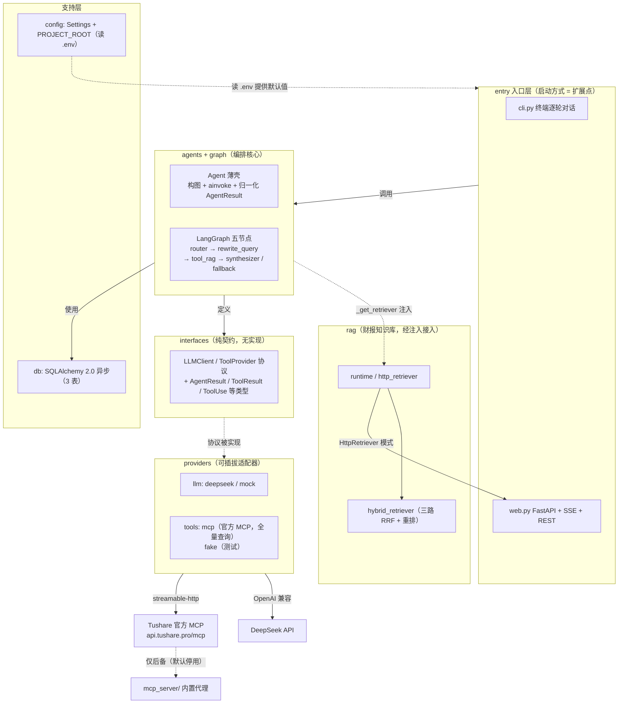
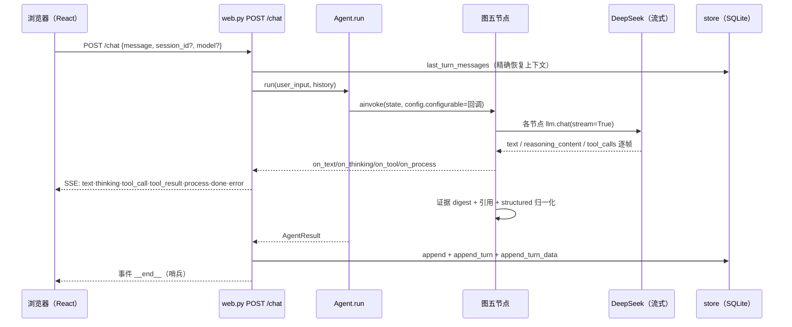
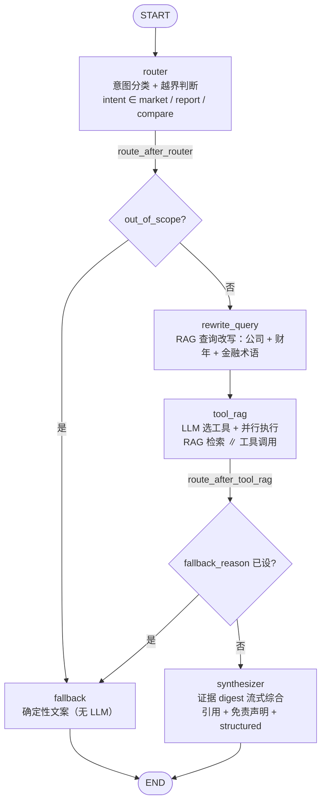
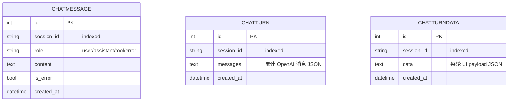
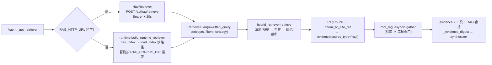

# 系统架构（当前实现）：LangGraph 五节点状态机的 LLM+MCP 全量数据助手

> 本文档以**当前代码为准**（核对日期 2026-08-27）。描述 `demo-mcp`（`D:\TushareAgent`）实际的层次结构、LangGraph 状态机、各组件运行语义与部署形态。
> - RAG 全量细节见 `RAG_INTEGRATION.md`（现状权威）；RAG 的设计动因（为何混合检索、如何保证引用不编造）见 `RAG_FINANCE.md`（设计蓝图）；现已废弃的语义工具层设计（历史背景）见 `tool-call-layer.md`。
> - 凡标注「**未实现 / 预留 / 遗留**」的构件请以第 14 节的如实清单为准，不要据此推断代码行为。

## 1. 概述与文档地图

`demo-mcp` 是一个独立运行的 LLM + MCP 数据对话助手：用户用自然语言提问，内置智能体（LangGraph 状态图）自行决定调用哪个工具、经 MCP client 以 streamable-http 连接 **Tushare 官方 MCP**（`TUSHARE_MCP_URL`，token 放 URL query），取数后**并行**检索 RAG 财报知识库，再把「工具证据 + RAG 证据」综合成带确定性引用的中文回答。支持 CLI 与 SSE Web 两个入口，SQLAlchemy 持久化会话历史与每轮 UI 数据。内置 `mcp_server/`（本地代理→每接口工具）默认停用、仅作后备。

本仓库 docs\ 文档矩阵（README.md 的「文档」节为门面，此处是权威描述）：

| 文档 | 状态 | 一句话 |
|---|---|---|
| `ARCHITECTURE.md`（本文） | 当前实现 | 系统架构：五节点状态机、层次、运行语义、部署 |
| `RAG_INTEGRATION.md` | 当前实现 | RAG 集成与运行：检索计划、RRF、持久化、HTTP 服务、全量配置表 |
| `RAG_FINANCE.md` | 设计蓝图 | RAG 动机与评估标准（含「实现状态」核对表） |
| `tool-call-layer.md` | 设计→已废弃 | ~~语义工具层设计（双票限定、4 工具）~~ 现直达原始 MCP 做全量查询 |
| `TEST_REPORT.md` | 测试记录 | 2026-08-27 完整测试（3 次 + 量化评分卡 89.4/100）：pytest 169 项、RAG 离线/真引擎指标、E2E |

## 2. 分层架构

分层严格、依赖单向：`entry → agents → interfaces`；`providers → interfaces`；`config` 为叶子；`db` 被 entry 使用；`rag` 经 `Agent._get_retriever` **注入**到图（不是纯独立模块，见第 10 节）。

各层职责与替代「扩展点」：

| 层 | 职责 | 扩展方式 |
|---|---|---|
| `entry` | 启动方式（CLI / Web / 批量 / HTTP API） | 加一个入口文件 |
| `agents` | Agent 薄壳：构图 + ainvoke + 结果归一化 | 改 `agent.py` |
| `graph` | 五节点状态机：路由 → 改写 → 工具+检索 → 综合/兜底 | 改 `nodes.py` 或加新节点 |
| `interfaces` | 类型 + 两协议（`LLMClient` / `ToolProvider`） | 改协议即改所有适配器（谨慎） |
| `providers/tools` | 工具来源（MCP / 语义层 stocks / 假） | 加 `xxx.py` |
| `providers/llm` | 具体 LLM 后端 | 加 `xxx.py` 实现 `interfaces.llm_client` |
| `rag` | 财报知识库（解析/检索/引用） | 改 `rag/*`；换检索后端见 `RAG_INTEGRATION.md` §1 |
| `db` | 会话历史持久化 | 加模型 / 扩展 `store.py` |
| `config` | 环境变量、路径、透传参数 | 加字段即可 |

## 3. 运行入口与生命周期

### 3.1 CLI（`demomcp/entry/cli.py`）

`main()`：要求 `settings.ds_api_key`（缺失 exit 2）→ 建 `DeepSeekLLMClient`、`store = build_store(effective_database_url)` + `store.init()` → `async with mcp_tool_provider(...) as tools:` 直接用 `tools`（原始 MCP provider）构 `Agent(llm, tools=tools, config=settings)`。每轮：`agent.run(prompt, history=history, on_text, on_thinking)` 打印 `[stop: {stopped_reason}]`，逐消息 `store.append(session_id, "user"/"assistant"/"tool", …)`，`history = result.messages`（下轮携带完整 OpenAI 风格消息列表）。`exit/quit/q` 退出。

### 3.2 Web（`demomcp/entry/web.py`，FastAPI `Tushare demo-mcp`）

- `lifespan`：按 `settings.effective_database_url` 建 store + `init()`，存 `app.state`；关停时 dispose（store 跨请求复用）。
- `POST /chat`（`ChatRequest{message, session_id?, model?}`，`model` 供前端「深度思考」开关传 `deepseek-reasoner`）：返回 SSE `StreamingResponse`。**每请求新建** `DeepSeekLLMClient`（model = 请求或 settings 默认）+ `mcp_tool_provider`（原始 MCP）+ `Agent`（MCP 会话只存活一轮）。
  - 恢复：`store.last_turn_messages(session_id)` 拿上一轮完整消息（含 tool_calls/tool_call_id）精确还原上下文。
  - SSE 事件：`text` / `thinking` / `tool_call{name,input}` / `tool_result{content,ok}` / `process{kind,data}` / `done{stopped_reason,session_id,usage,structured}` / `error`，末尾 `__end__` 哨兵。
  - 落库三连：`append`（每消息）+ `append_turn`（整轮消息 JSON）+ `append_turn_data`（UI payload：query/thinking/steps/answer/sources/citations/claims/metadata/intent/strategy/stopped_reason/usage/error）。
- REST：`GET /api/sessions`、`GET /api/sessions/{id}`、`GET /api/sessions/{id}/turns`、`DELETE /api/sessions/{id}`；RAG 端点 `POST /api/rag/retrieve` 与 `GET /api/rag/health`（见 `RAG_INTEGRATION.md` §6）。
- 静态：若存在 `scripts/web/dist` 则 `StaticFiles(html=True)` 挂载前端构建产物。

## 4. LangGraph 图拓扑（五节点）

`build_research_graph(llm, tools, tool_defs, *, max_tokens, disclaimer, base_system="", retriever=None)`（`graph/builder.py`）注册五个节点并连边；**LLM/工具/retriever 在构图时闭包注入**，**运行期回调**（`on_text`/`on_thinking`/`on_tool`/`on_process`）经 `config["configurable"]` 透传（`nodes.py` 内 `_cf` 读取）。

| 边 | 条件函数 | 分支 |
|---|---|---|
| START→router | — | 恒走 |
| router→? | `route_after_router` | `out_of_scope=True` → **fallback**；否则 → **rewrite_query** |
| rewrite_query→tool_rag | — | 恒走 |
| tool_rag→? | `route_after_tool_rag` | `state.fallback_reason` 已设 → **fallback**；否则 → **synthesizer** |
| synthesizer/fallback→END | — | 恒走 |

> 图中**没有回环边**：旧版文档中「合成器质量自检 → 重试/回环」的设计**未实现**（见 §14）。当前每条用户消息只走一条单向路径。

节点职责一览（`graph/nodes.py`）：

| 节点 | 行为要点 | process 事件 |
|---|---|---|
| `router` | 非流式 `llm.chat`（温度 0），strict JSON `{intent, out_of_scope}`；intent 只认 `market/report/compare`；LLM 异常 → 默认 `market, False`（自愈） | `intent` |
| `rewrite_query` | LLM 改写查询（公司+财年+金融术语，温度 0）；`llm=None` 或失败 → 确定性改写 `_deterministic_rewrite`（原文+公司+年份+术语展开去重） | `rewrite` |
| `tool_rag` | 一次**流式** LLM 选工具；有工具调用则 `asyncio.gather(RAG 检索, *工具调用)` **并行**；结果归一化（见 §8/§10）；双空才 `no_evidence` | `stage/retrieval/funnel/plan/params/validation/aggregate` |
| `synthesizer` | 只喂 **证据摘要**（`_evidence_digest`，不喂全量消息）；流式生成；成功 → `end_turn` + `structured` | — |
| `fallback` | 确定性文案（无 LLM），按 out_of_scope/`no_progress`/`no_evidence`/`node_error` 分支；追加 ≤3 条校验错误与免责声明；最小 structured | — |

## 5. GraphState 状态设计（`graph/state.py`）

`TypedDict(total=False)`，`messages` 为**普通 list 追加**（OpenAI 风格 dict，由 `Agent.run` 管理，**不用 `add_messages` reducer**）：

| 字段 | 类型 | 写入者 | 说明 |
|---|---|---|---|
| `messages` | `list[dict]` | Agent.run | user/assistant/tool 完整上下文 |
| `original_query` | `str` | 初始 state | 用户原始问题 |
| `rewritten_query` | `str` | rewrite_query | 供 RAG 检索的改写查询 |
| `intent` | `str | None` | router | `market`/`report`/`compare` |
| `out_of_scope` | `bool` | router | 越界 → fallback |
| `retrieval_plan` | `list[dict]` | **无人写入（死字段）** | 声明于 state，实际计划是 `_rag_retrieve` 内局部 `RetrievalPlan` |
| `tool_results` | `list[ToolResult]` | tool_rag | 工具返回向量 |
| `evidence` | `list[dict]` | tool_rag | `{source_type, source, content, cite?, params?}` 合并视图 |
| `rag_chunks` | `list[Any]` | tool_rag | `RagChunk`，非空即 RAG 证据可用 |
| `request_params` | `dict | None` | tool_rag | 归一化参数（ts_code/日期/adj/期数） |
| `validation_errors` | `list[str]` | tool_rag | 友好的校验失败信息（一等公民） |
| `final_answer` | `str | None` | synthesizer/fallback | 最终文本 |
| `citations` | `list[str]` | synthesizer | `sorted(set(evidence 来源))` |
| `structured` | `dict | None` | synthesizer/fallback | answer/intent/strategy/sources/citations/claims/metadata |
| `usage` | `dict | None` | — | token 用量 |
| `stopped_reason` | `str` | 各终止节点 | `end_turn` / `fallback`（兜底文案）/ `error`（Agent 层） |

## 6. Agent 薄壳（`agents/agent.py`）

`Agent(llm, tools, config)` 是叠加在编译图上的薄壳：

- `_get_tool_defs()`：懒加载 `await tools.list_tools()`（MCP 自动发现并打印清单）。
- `_get_retriever()`：懒加载；**`cfg.rag_http_url` 非空 → `HttpRetriever(url, timeout=rag_http_timeout, token=rag_http_token)`**（本进程不开 Milvus）；否则 `rag.runtime.build_runtime_retriever(cfg)`（`has_index` 快载或按 `RAG_CORPUS_DIR` 摄取）；**任何构建异常 → 打印并返回 `None`**（检索退化、不崩）。
- `_get_graph()`：一次性 `build_research_graph(llm, tools, tool_defs, max_tokens, disclaimer, base_system=system_prompt, retriever=retriever)`。
- `run(user_input, *, history, on_text, on_thinking, on_tool, on_process)`：`messages = history + [user]`，初始 state 种子（`original_query`、`out_of_scope=False`、空 list、`stopped_reason="end_turn"`）→ `ainvoke`。
  - 图抛 `Exception`（含 `ExceptionGroup`）→ 返回 `AgentResult(final_text=f"处理失败：{type(exc).__name__}…", stopped_reason="error", …)`。
  - **不捕 `BaseException`**（`asyncio.CancelledError`、客户端断连/`task.cancel()` 照常透传）——避免 LangGraph 把节点异常汇成 `ExceptionGroup` 上抛。
- 归一化：`AgentResult(final_text, stopped_reason, messages, tool_results, usage, citations, structured)`。

## 7. 接口契约层（`interfaces/`）

- `types.py`：`ToolSpec{name, description, input_schema}`、`ToolResult{content, is_error}`、`ToolUse{id, name, input}`、`ChatResponse{stop_reason, tool_uses, raw_content, text, thinking, usage}`、`AgentResult{final_text, stopped_reason, messages, tool_results, usage, citations, structured}`。
- `llm_client.py`（`@runtime_checkable` Protocol）：`async chat(*, messages, tools, system, max_tokens, stream=True, temperature=None, on_text, on_thinking) -> ChatResponse`；`assistant_message(resp) -> dict`；`tool_results_messages(results) -> list[dict]`（消息帧由 LLM 实现渲染 → 换后端不改图）。
- `tool_provider.py`（Protocol）：`async list_tools() -> list[ToolSpec]`；`async call_tool(name, arguments=None) -> ToolResult`（约定「吞异常转 `is_error=True`」）。
- RAG 计划/结果类型在 `rag/schemas.py`（`RetrievalPlan`、`RagChunk`、`CiteRef`、`RagFilters`），不在 interfaces（RAG 是可注入组件而非基础协议）。

## 8. providers

### 8.1 tools/mcp.py（`MCPToolProvider`）

包裹一个复用整会话的 `mcp.ClientSession`：`list_tools` 自动发现 + 一次性打印清单；`call_tool` 的 `read_timeout_seconds` 是 **`timedelta` 不是秒**。重试语义（`mcp_retries` 次、退避 `min(0.5*2**attempt, 2.0)`）**同时适用三类**：

1. 抛出的异常（连接/超时等）→ 重试，耗尽 → `is_error=True`；
2. `result.isError` 或解析 JSON 的 `code!=0`（`_is_business_error`）→ **也重试**；
3. 耗尽后仍业务失败：文案含「积分/权限/无权限/提升/points」→ `is_error=False` 的友好中文提示（让 LLM 转述「积分不足」）；其它业务失败 → 保留原文 + `is_error=last_was_error`。

### 8.2 tools/（`MCPToolProvider`，直接全量取数）

> **变更（2026-09）**：曾存在一层「语义工具层」`StockToolProvider`（`stocks.py`），用硬允许列表 `ALLOWLIST=("002594.SZ","300750.SZ")` 把数据面限定为比亚迪/宁德时代、只暴露 4 个语义工具。现已**移除该层**：应用直接使用原始 `MCPToolProvider` 作为 `Agent` 的 `tools`，LLM 看到服务端暴露的全部工具（`list_apis` / `get_api_info` / `query` + 各接口工具），可查**任意 A 股/任意接口**。`stocks.py` 及 `DEMO_STOCKS`/`STOCK_*` 配置同步删除。

`MCPToolProvider`（`mcp.py`）经 `mcp_tool_provider(url, timeout, retries)` 连接服务端；`list_tools` 自动发现并一次性打印工具清单；`call_tool` 的 `read_timeout_seconds` 是 **`timedelta` 不是秒**。取数结果约定 `{code, msg, row_count, data}`：`code!=0`（权限/积分不足、接口下线）为**业务结果** → 友好 `is_error=False` 让 LLM 转述；真正的传输/异常才 `is_error=True`。重试语义（`DEMO_MCP_RETRIES` 次、退避 `min(0.5*2**attempt, 2.0)`）同时适用异常与业务失败。

### 8.2b 动态工具目录（`graph/tool_select.py` + `providers/tools/curate.py`）

全量工具会撑爆上下文、且大量接口权限/积分用不了，故 `tool_rag` 选工具那轮**只把相关子集喂给 LLM**：

- **相关性过滤（恒开）**：`graph.tool_select.select_tools(specs, query, *, max_revealed=12, meta, catalog)` 在 `tool_rag` 内每次用 `state.original_query` 裁剪 `tool_defs`——恒保留 meta 发现工具（`list_apis`/`get_api_info`/`query`/`stock_basic`，`query` 是没被揭示接口的逃生通道），其余按「工具名/描述与 query 的金融词汇重叠」打分取 top-K（复用 `rag.query_build.extract_concepts`/`FIN_TERMS` + 本地领域词表）；零命中回落仅 meta。**执行仍是全量** `tools.call_tool`（`nodes.py` 的 `_safe_call_tool`），过滤只收窄 LLM 能选的，不破坏调用。
- **可用性探测（默认关、按需）**：`providers/tools/curate.probe_availability` 逐个接口真实调用一次，按 `code`/`msg` 分桶 `usable`/`blocked`(积分/权限)/`down`(下线) 并缓存到 `TOOL_PROBE_CACHE_PATH`（默认 `data/tool_catalog.json`）；`Agent` 加载缓存后 `select_tools(catalog=...)` 剔除 blocked/down。默认关（`TOOL_PROBE_ENABLED=false`）避免烧积分/规避官方 MCP 契约未知风险；`uv run scripts/probe_tools.py` 可手动跑一次落盘。
- **配置**：`TOOL_MAX_REVEALED`(12)、`TOOL_META_ALWAYS`(true)、`TOOL_PROBE_ENABLED`(false)、`TOOL_PROBE_CACHE_PATH`、`TOOL_PROBE_CONCURRENCY`(4)。

### 8.3 llm/deepseek.py（`DeepSeekLLMClient`）

OpenAI 兼容 `AsyncOpenAI`；`chat(stream=True)` 逐 delta：text → `on_text`、`reasoning_content` → `on_thinking`、工具调用按 `tc.index` 分片聚合、usage 任意 chunk 捡起；非流式 `_chat_once` 解析 tool_calls 为 `ToolUse` + 原始 dict；`map_finish`：tool_calls→`tool_use`、length→`max_tokens`、stop/None→`end_turn`。`llm/mock.py` `MockLLM` 弹预置回复并重放回调（测试用）。

## 9. 会话持久化（`db/`）

`ChatHistoryStore`（SQLAlchemy 2.0 异步 + aiosqlite；`demo.db` 即历史库）：

- `ChatMessage`：`session_id/role/content/is_error/created_at` —— 可读日志（含 `role=tool|error`）。
- `ChatTurn`：`session_id/messages(JSON)` —— 每轮**完整累积** OpenAI 消息（含 tool_calls/tool_call_id），供 `last_turn_messages` 精确恢复。
- `ChatTurnData`：`session_id/data(JSON)` —— 每轮 UI payload（thinking/steps/answer/sources/citations/claims/metadata/intent/strategy/stopped_reason/usage/error），由 `/api/sessions/{id}/turns` 回传。

> 三者以 `session_id` 逻辑关联（无外键）；**`create_all` 不会 ALTER 既有表** —— 改了 `models.py` 后需删旧库（schema 漂移会 500）。

## 10. RAG 接线（摘要，细节见 `RAG_INTEGRATION.md`）

RAG **已接入实时图**：`tool_rag` 节点在单回合 LLM 选工具后，`asyncio.gather` 并行执行「RAG 检索」与「全部工具调用」；检索非空（且工具证据为空）时 `synthesizer` 只基于 RAG 证据生成。`market` 意图跳过 RAG（纯行情走工具）。

- `RetrievalPlan` 以 `state.rewritten_query or original_query` 为查询、`extract_concepts` 提概念、`infer_filters` 从硬编码别名表（比亚迪/宁德时代）提 `RagFilters{company,year}`、`_strategy(intent)` 映射：`report→factual`、`compare→structural`、其它→`auto`。
- 证据条目 `source_type="rag"`，摘要 `cite` 由 `rag/citing.py` 确定性生成（`[公司·年份年报 - 第X页 章节]`，**不靠 LLM 编页码**）。
- `rag/retriever.py` 的 `NullRetriever` 为**遗留占位、无引用**；`rag/__init__.py` 保持无 import（重依赖函数体懒加载）。

## 11. 配置（`config/settings.py`，读 `PROJECT_ROOT/.env`）

非 RAG 全量 + RAG 核心 8 项（RAG 全量表见 `RAG_INTEGRATION.md` §7，`demomcp/config/settings.py` 是唯一事实源）：

| 组 | 变量（默认值） |
|---|---|
| LLM | `DS_API_KEY`、`DS_BASE_URL`(api.deepseek.com)、`DS_MODEL`(deepseek-chat)、`DS_STREAMING`(true)、`DS_MAX_TOKENS`(8192) |
| Agent | `DEMO_SYSTEM_PROMPT`(内置全量金融 prompt：任意 A 股/全量接口 list_apis→get_api_info→query)、`DEMO_MAX_ITERATIONS`(10，agentic tool loop 取数轮次上限)、`DISCLAIMER` |
| DB | `DEMO_DATABASE_URL`(空→`sqlite+aiosqlite:///{PROJECT_ROOT/demo.db}`；也支持 mysql/asyncmy、postgres/asyncpg) |
| MCP | `TUSHARE_MCP_URL`(api.tushare.pro/mcp/)、`DEMO_MCP_TIMEOUT`(30s)、`DEMO_MCP_RETRIES`(2) |
| RAG（核心） | `RAG_USE_REAL`(false)、`RAG_VECTOR_STORE_PATH`(root/data/vectorstore)、`RAG_CORPUS_DIR`(空=不自动摄取)、`RAG_HTTP_URL`/`RAG_HTTP_TIMEOUT`(20)/`RAG_HTTP_TOKEN`、`RAG_TOP_K`(5)、`RAG_EMBEDDING_MODEL`(BAAI/bge-m3) |
| mcp_server（后备） | `MCP_SERVER_HOST`(127.0.0.1)/`MCP_SERVER_PORT`(8765)、`TUSHARE_PROXY_URL`(http://127.0.0.1:8000)、`TUSHARE_API_KEY`、`TUSHARE_PROXY_TIMEOUT` |

## 12. 部署与脚本

- **Dockerfile** 两阶段：① `node:20-alpine` `npm ci && npm run build` → `scripts/web/dist`；② `python:3.11-slim` + uv 二进制，`uv sync --no-dev`，非 root `app` 用户，EXPOSE 8010，CMD `uvicorn demomcp.entry.web:app --host 0.0.0.0 --port 8010`。
- **docker-compose**：单服务 `demo`，端口 `8010:8010`，env_file `.env`，卷 `demo_data → /app/data`（demo.db 与 RAG 向量库落此），`restart: unless-stopped`。
- **无独立 RAG 端口**：`/api/rag/retrieve`、`/api/rag/health` 挂在 web 8010 上（历史的 `rag_server.log` 即 web 自身日志）。
- **scripts\**：

| 脚本 | 用途 |
|---|---|
| `scripts/smoke_e2e.py` | 真 DS_API_KEY + 官方 MCP 的端到端冒烟 |
| `scripts/eval_rag.py` | RAG 离线评估（默认合成语料；`--corpus` 真实 PDF；门禁见 RAG_INTEGRATION §8） |
| `scripts/validate_rag.py` | 真引擎（bge-m3 + reranker）对两份真实年报的验证门禁 |
| `scripts/dba_rag.py` | 离线批量建索引（`--corpus`/`--rebuild`/`--hashing`） |

## 13. 未实现 / 预留 / 遗留（如实清单）

| 项 | 状态 | 说明 |
|---|---|---|
| 合成器质量自检回环（旧文档 §10 设计） | **未实现** | 图上已有 `tool_rag` 的**取数自环**，但「合成器质量自检」回环仍未实现；合成失败直接转 fallback 文案 |
| `RAG_SCORE_THRESHOLD`（0.3） | **声明但无读取者** | settings 里有默认值与别名，代码从未读 |
| `GraphState.retrieval_plan` | **死字段** | 声明于 state.py，无节点写入 |
| `RAG_HYBRID_DENSE_WEIGHT`（0.6） | **预留** | 实际检索为三路纯 RRF 融合，无读取者 |
| `DEMO_MAX_ITERATIONS`（10） | **无读取者** | 图无循环，名字仍留在 settings |
| `rag/retriever.py` `NullRetriever` | **遗留占位** | 无任何 import；真入口是 runtime/http_retriever |
| `RAG_HYDE` | **未实现（默认 false）** | 查询扩展开关在 `query_build` 里未启用 hyDE 分支 |
| `rag_corpus_dir` 自动扫描 docs\ | **未实现** | 仅显式设置 `RAG_CORPUS_DIR` 才摄取；路径启发式：年从文件名、公司从目录/《》 |
| Milvus-Lite 单写者 | **设计约束** | 非文件锁：web 进程持锁，其它进程用 `HttpRetriever`；`dba_rag --rebuild` 需与 web 错时 |
| `citation.schemas.Citation` | **声明未用** | 图实际产出 CiteRef 推导的普通 dict |
| 工具层「未知接口动态发现」、「跨公司结构化合成」等 RAG_FINANCE 未来项 | **未实现** | 见 `RAG_FINANCE.md` |

## 14. 附录

### 14.1 关键文件

`demomcp/graph/{builder,nodes,routes,prompts,state}.py` · `demomcp/agents/agent.py` · `demomcp/providers/llm/{deepseek,mock}.py` · `demomcp/providers/tools/{mcp,stocks,fake}.py` · `demomcp/interfaces/{types,llm_client,tool_provider}.py` · `demomcp/rag/`（`RAG_INTEGRATION.md` §10）· `demomcp/db/{models,store}.py` · `demomcp/config/{settings,env}.py` · `demomcp/entry/{cli,web}.py` · `mcp_server/server.py`（后备）

### 14.2 数据流示例（「比亚迪最近一个月日线」）

router（market）→ rewrite_query（改写但不强制 RAG）→ tool_rag（`_should_rag` 对 market 跳过检索；LLM 选 `query`/行情接口工具，`ts_code=002594.SZ`、日期近 30 天）→ 工具返回 `{code,msg,row_count,data}` → 进 evidence（`source_type`＝工具名，`params` 并入 request_params）→ synthesizer 流式中文回答（含免责声明）→ `end_turn`+structured → web 三写落库。若取数抛真异常 → `is_error=True` 且无其它证据 → `no_evidence` → fallback 文案。

### 14.3 旧版已删除的声明（迁移速查）

下列内容在旧版 `ARCHITECTURE.md` 出现过，**当前代码不存在**：四节点拓扑（现为五节点，且 `tool_rag` 带**条件自环**，图上可回环）；`tool_evidences/claims/verification/structured_output/retry_count` State 字段；`add_messages` reducer；手动 agentic loop（`for _ in range(max_iterations)`，已被**图上条件自环**取代）；`agents/registry.py CompositeToolProvider`；Chroma/FAISS + `sentence-transformers` 本地嵌入；`RAG_CHUNK_SIZE=800/150`、`SYNTH_MAX_RETRY` 配置；`StructuredAnswer`/`Claim` Pydantic 模型（现为 `structured: dict`）。
