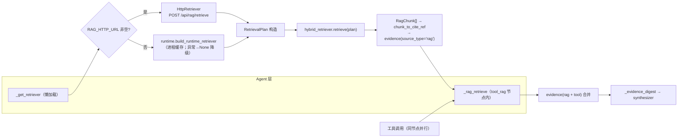
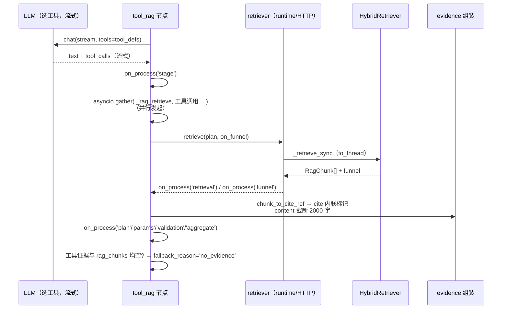
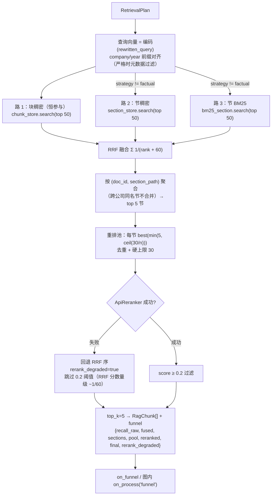
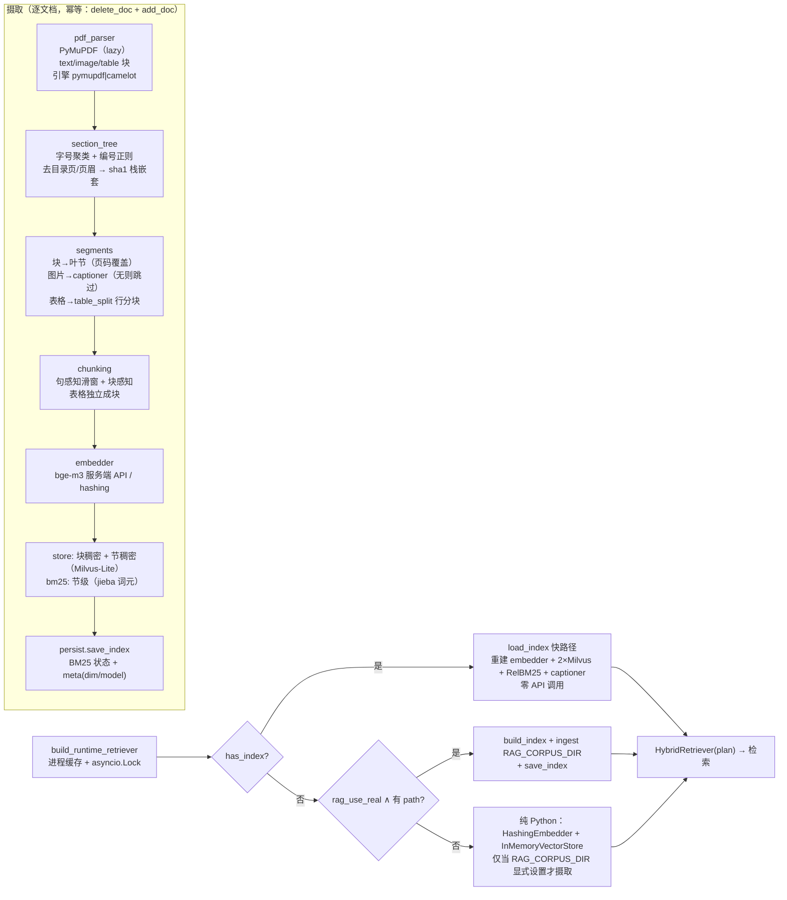
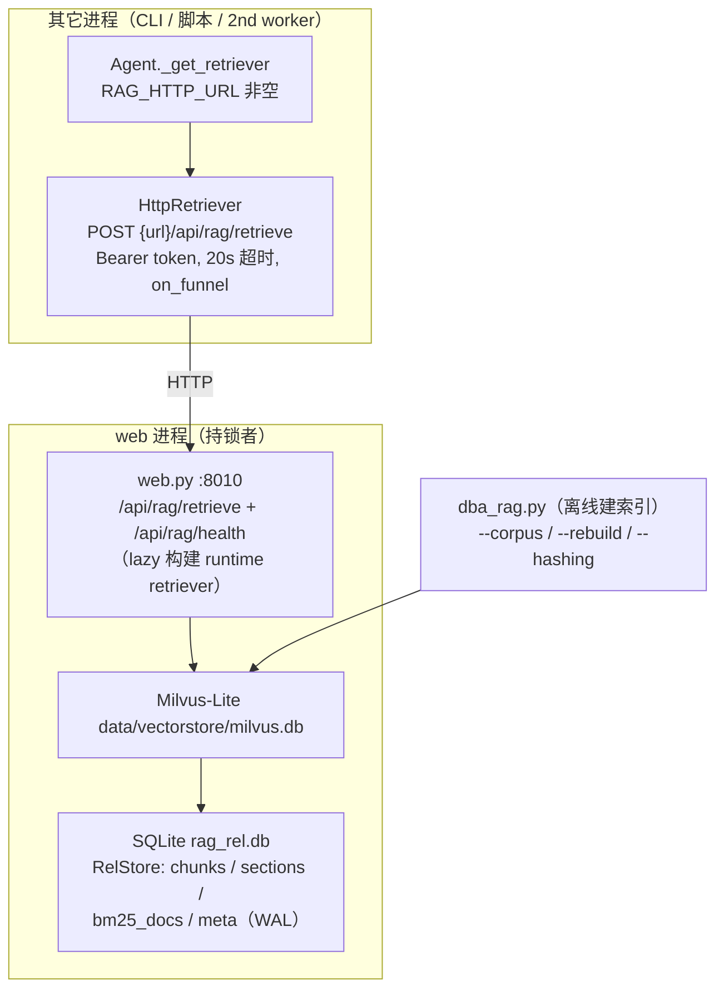

# RAG 财报知识库集成与运行（当前实现）

> 本文档以**当前代码为准**（核对日期 2026-08-27），描述 `demomcp/rag/` 与实时 LangGraph 循环的实际接法与运行机制，是 RAG 的**现状权威**。
> - `ARCHITECTURE.md`：系统架构（只含 RAG 摘要 §10）；`RAG_FINANCE.md`：设计蓝图（为何这么设计、评估标准）。
> - 早期文档中「无 rewrite_query 节点」「在线路径 `RagFilters()` 恒空」「structured/citations 不落库」等描述均已过时，以本文为准。

## 0. 摘要与定位

RAG **已接入实时图**：`tool_rag` 节点的单回合 LLM 选工具后，`asyncio.gather` **并行**执行「RAG 检索」与「全部工具调用」；检索出的 `RagChunk` 经 `chunk_to_cite_ref` 生成带内联引用的证据；`synthesizer` 只读证据摘要生成回答；`structured.sources/citations/claims/metadata` 携带页码/章节/公司/年份等元数据并经 `chat_turn_data` 落库、`/api/sessions/{id}/turns` 回传前端。

一句话链路：

```
Settings ─▶ Agent._get_retriever ─▶ (RAG_HTTP_URL? → HttpRetriever : runtime.build_runtime_retriever)
                                    └▶ 注入 build_research_graph(retriever=…) ─▶ tool_rag._rag_retrieve
```

> 遗留：`demomcp/rag/retriever.py` 的 `NullRetriever` 无任何引用（占位遗留）；真实检索后端是 `runtime.py` / `http_retriever.py` / `hybrid_retriever.py`。

## 1. 接线概览



- **检索器可降级**：`_get_retriever` 里任何构建异常都 `print` 并返回 `None` —— 图上只是没有 RAG 证据，主链路不崩（有工具证据时照常综合）。
- **`market` 意图跳过 RAG**（`_should_rag`：`(intent or "market") != "market"` 才检索）：纯行情/指标问题是工具的事。
- **RetrievalPlan 构造**（`nodes.py::_rag_retrieve`）：
  - `rewritten_query = state.rewritten_query or original_query`（`rewrite_query` 节点的产出，失败有确定性降级）；
  - `concepts = extract_concepts(q)`、`filters = infer_filters(q)`（硬编码别名表：比亚迪/宁德时代 → `RagFilters{company, year}`，**在线路径过滤生效**）；
  - `strategy = _strategy(intent)`：`report→factual`、`compare→structural`、其它→`auto`；
  - 检索异常 → `[]`（不崩图），图内只丢 RAG 证据。

## 2. 检索契约与图内时序

接口（`rag/schemas.py`）：`RetrievalPlan{rewritten_query, concepts, filters: RagFilters{company?, year?}, strategy: "structural"|"factual"|"auto"}`；`RagChunk{doc_id, doc_title, chunk_index, text, score, metadata}`（metadata 含 公司/年份/页码/章节）；`CiteRef`（确定性引用：`inline` 内联标记 + 公司/年份/页码/章节/表格题注）。



**fallback_reason 三种取值**（`route_after_tool_rag` 据此走 fallback）：

| 值 | 条件 |
|---|---|
| `no_evidence` | **工具证据与 rag_chunks 双空**（单空不兜底） |
| `no_progress` | 无工具调用且 RAG 与内容皆空（首轮 LLM 什么都没产出） |
| `node_error` | 选工具那轮 LLM 调用失败（且双空） |

## 3. 证据与上下文工程

- 证据条目：`{source_type: "rag"|工具名, source, content, cite?, params?}`；RAG 的 `cite` 由 `chunk_to_cite_ref` 生成（格式 `[公司·年份年报 - 第X页 章节]`，页范围如 `42-43`，表格附题注后缀）。
- `content` 截断 `_MAX_EVIDENCE_CHARS = 2000`（`nodes.py`）。
- **`synthesizer` 只喂摘要**（`_evidence_digest`），不喂全量 messages（控上下文）：`[i] 【marker】content`，工具条目含 `请求参数=`。
- `citations = sorted({str(e["source"])})`；摘要含引用标记 `[n]` 对应证据序。
- 成功 → `stopped_reason="end_turn"`；`structured = {answer, intent, strategy, sources, citations, claims, metadata}`；`metadata = {request: request_params, validation: {errors, normalized}, tool_results: n, rag_chunks: n}`；RAG 来源按 `("rag", inline)` 去重、工具按 `("tool", source)`。
- 免责声明：synthesizer/fallback 追加 `DISCLAIMER` 文案（若已有则不重复）。

## 4. HybridRetriever 执行细节（`rag/hybrid_retriever.py`）



要点（数值均来自 `Settings`，默认值见 §7）：

- **三路 RRF 融合**，分数 `Σ 1/(rank + k)`，`k = RAG_RRF_K = 60`。
- **块稠密恒参与**（表格块在 chunk store 里，`structural` 也不能丢表格召回）；节稠密 + 节 BM25 仅在 `factual` 时关闭。
- 聚合键 `(doc_id, section_path)`：不同公司同名章节不合并；保留 `RAG_TOP_K_SECTIONS = 5` 节。
- 每节候选池：`max(top_k, ceil(rag_rerank_candidates / n_sections))`，去重后硬上限 `RAG_RERANK_CANDIDATES = 30`；无 chunk 的节回退到节级候选。
- **表格保底**（2026-08-27 新增）：每个命中节若有表格块，至少保留最优 1 块；若池顶 30 将表格全部挤出，则把各节保底表格块回补进池——防止财务数值（表格块在 rerank 分数下常偏低）被池顶/阈值误杀。
- `ApiReranker`（SiliconFlow `/rerank`，bge-reranker-v2-m3）失败 → **回退 RRF 序且跳过阈值截断**（RRF 分数量级约 1/60，会被 0.2 阈值全灭）；`rerank_degraded` 计数反映退化。
- 查询向量带 `"{company}{year} "` 前缀与摄入端对齐（向量化包含元数据）；过滤仅在 `rag_strict_scope` 且存在对应维度时应用。

## 5. 摄取与运行时（`rag/runtime.py` / `rag/ingest.py`）



- `build_index(config)`：探测器 `pymilvus` import；`rag_use_real`+路径时建 Milvus 向量库 + `RelStore`，否则内存向量库 + 内存 BM25；`build_captioner(config)`；heavy import 失败 → 打印并返回 `None`（`build_runtime_retriever` 同语义，**不崩**）。
- **`RAG_CORPUS_DIR` 只有显式设置才摄取**（空 → 不自动扫 `docs\`，避免测试环境加载 pymupdf）；每 PDF try/except 尽力而为；`_doc_meta_from_path` 启发式：年从文件名、公司从 `{公司}/{年份}` 目录或《》号。
- 嵌入输入格式：`{company}{year} {'>'.join(section_path)} {heading} text`（检索端同构前缀）。
- 模型/引擎默认：嵌入 `BAAI/bge-m3`（OpenAI 兼容 `/embeddings`，batch 32，维度从首个响应自动发现；无 key → hashing）；重排 `BAAI/bge-reranker-v2-m3`；图片描述 `deepseek-v4-flash-vision-exp`（无 `DS_API_KEY` → Noop，图片跳过）。

## 6. 持久化拓扑与 HTTP 服务



- **单写者约束（设计保证，非文件锁）**：Milvus-Lite 只能被一个进程打开 —— web 持锁；其它进程一律经 `RAG_HTTP_URL` 走 `HttpRetriever` 取数；`dba_rag.py --rebuild` 删目录重建时需与 web 错时。
- **无独立 RAG 端口**：`/api/rag/retrieve`（body = `RetrievalPlan` JSON，返回 `{chunks: [{...RagChunk}], funnel, degraded}`）与 `/api/rag/health`（`{ok, chunks: 索引块数|null}`）挂在本应用 8010；`demomcp/rag/server.py` 只提供纯函数 `retrieve_from`/`health_from`（retriever=None → degraded）。
- `RelStore`（persist.py）：chunks 文本/元数据惰性落 SQLite；**BM25 以 `tf_json`/`df`/`total_len` 存库，查询时 SQLite 实时评分**（无需重建内存索引）；`has_index` = milvus.db + rag_rel.db 存在且 chunks 表非空；`save_index` 写 BM25 状态 + meta(dim/model)；`load_index` 零 API 调用快载。
- `HttpRetriever`：httpx POST，`transport` 可注入（测试 MockTransport）；funnel 经 `on_funnel` 回调转发。

## 7. 配置（RAG_* 全量；唯一全量处，值 = `demomcp/config/settings.py`）

| 变量 | 默认 | 说明 |
|---|---|---|
| `RAG_USE_REAL` | `false` | 真后端（Milvus-Lite + API 嵌入/重排 + pymupdf）；false → 纯 Python 兜底 |
| `RAG_VECTOR_STORE_PATH` | `<root>/data/vectorstore` | milvus.db + rag_rel.db 落盘目录 |
| `RAG_EMBEDDING_MODEL` | `BAAI/bge-m3` | 嵌入模型（OpenAI 兼容 `/embeddings` 服务端）；`hashing` = 测试兜底 |
| `RAG_EMBEDDING_API_BASE` | `https://api.siliconflow.cn/v1` | 嵌入服务 base_url |
| `RAG_EMBEDDING_API_KEY` | `""` | 为空 → 回退 hashing |
| `RAG_EMBEDDING_DIM` | `256` | hashing 嵌入维度（bge-m3 维度由响应自动发现） |
| `RAG_CAPTIONER` | `deepseek-v4-flash-vision-exp` | 图表多模态描述模型；无 `DS_API_KEY` → Noop（跳过图片） |
| `RAG_RERANK_MODEL` | `BAAI/bge-reranker-v2-m3` | 重排模型（服务端）；无 key → Noop |
| `RAG_TOP_K` | `5` | 返回下游的 top-k |
| `RAG_CANDIDATE_K` | `50` | 每路候选数（recall-first） |
| `RAG_TOP_K_SECTIONS` | `5` | 聚合保留的 top 章节数 |
| `RAG_SCORE_THRESHOLD` | `0.3` | ⚠️ **声明但代码未读取**（预留） |
| `RAG_RERANK_THRESHOLD` | `0.2` | 重排后阈值（失败回退态跳过） |
| `RAG_RERANK_CANDIDATES` | `30` | 重排池硬上限 |
| `RAG_FIN_DENSE_CHUNK` | `400` | 稠密块目标字符数 |
| `RAG_FIN_DENSE_OVERLAP` | `80` | 稠密块重叠字符数 |
| `RAG_SECTION_MAX_CHARS` | `8000` | 整节文本上限（供 BM25） |
| `RAG_TABLE_ROWS_PER_CHUNK` | `8` | 表格行分块行数 |
| `RAG_HYBRID_DENSE_WEIGHT` | `0.6` | ⚠️ **预留**：实际三路纯 RRF 融合，无读取者 |
| `RAG_STRICT_SCOPE` | `true` | 严格限定语料来源（公司/年份过滤） |
| `RAG_HYDE` | `false` | 查询扩展 / hyDE（未启用分支） |
| `RAG_STRATEGY` | `auto` | `structural`/`factual`/`auto`（意图映射：report→factual、compare→structural） |
| `RAG_TABLE_ENGINE` | `pymupdf` | 表格抽取引擎：`pymupdf`/`camelot` |
| `RAG_RRF_K` | `60` | RRF 的 k |
| `RAG_BM25_K1` | `1.5` | BM25 k1 |
| `RAG_BM25_B` | `0.75` | BM25 b |
| `RAG_CORPUS_DIR` | `""` | **显式设置才摄取**（空不自动扫 docs\） |
| `RAG_HTTP_URL` | `""` | 非空 → 进程用 `HttpRetriever`（不开 Milvus） |
| `RAG_HTTP_TIMEOUT` | `20.0` | HTTP 检索超时（秒） |
| `RAG_HTTP_TOKEN` | `""` | HTTP 检索 Bearer token |

**开启真实 RAG 的最小步骤**：`uv sync --extra rag-full` → `.env` 设 `RAG_USE_REAL=true` + `RAG_VECTOR_STORE_PATH` + `RAG_CORPUS_DIR`（+ `RAG_EMBEDDING_API_KEY` 等）→ `scripts/dba_rag.py` 建索引。**不想让进程开 Milvus**（如 CLI 配 web 同时跑）：不设 `RAG_CORPUS_DIR`/`VECTOR_STORE_PATH`，改设 `RAG_HTTP_URL=http://127.0.0.1:8010`。

## 8. 验证脚本与测试

| 脚本 | 做什么 | 门禁 |
|---|---|---|
| `scripts/eval_rag.py` | 离线评估：默认合成语料（纯 Python，不联网），`--corpus` 对真实 PDF，`--gold/--top-k/--no-real` 可选；指标 context_recall@k / faithfulness / answer_relevance / table_triple_assertion / cross_company_isolation | recall@k ≥ 0.8 ∧ faithfulness ≥ 0.7 ∧ isolation == 1.0（table_triple 仅报告） |
| `scripts/validate_rag.py` | 真引擎（bge-m3 + bge-reranker）对 docs\ 两份 2025 年报：每公司 recall + 表格溯源 + 双向跨公司隔离；金标已按真实分块核校，匹配口径 = **章节锚定 或 页差≤1**（不依赖精确页码） | per-company recall ≥ 0.6 ∧ isolation |
| `scripts/dba_rag.py` | 离线批量建索引（`--corpus` 默认 RAG_CORPUS_DIR、`--rebuild` 删目录重建、`--hashing` 离线验证模式）；最近一次实测 chunk=2563 / section=443 | — |

测试：**20 个 `test_rag_*.py`**（含 `test_rag_import_guards`（`demomcp.rag` 无 import 守卫）、`test_rag_persist`（RelStore/BM25 往返/has_index）、`test_rag_http_retriever`（MockTransport 请求体与 chunks 还原）、`test_rag_server`（retrieve_from/health_from + web 端点 stub）、`test_rag_funnel`（funnel 阶段计数）、`test_rag_retriever`（RRF 数学/跨公司隔离/策略路由/阈值截断）……）；金标在 `tests/rag_golden/{qa,qa_real}.yaml`。

## 9. 已知边界与预留（如实）

1. **单写者**：Milvus-Lite 单进程锁，web 持锁；其余进程走 HTTP（§6）。`--rebuild` 需错时。
2. **无自动重摄取**：新增/更新 PDF 需重跑 `dba_rag.py`（add_doc 幂等 = delete + add 重建该文档）。
3. **RRF-only**：`RAG_HYBRID_DENSE_WEIGHT` 预留（§7）。
4. **hyDE off**；`RAG_SCORE_THRESHOLD` 未读。
5. **`rag/retriever.py` NullRetriever**：遗留占位、无引用。
6. **`GraphState.retrieval_plan`**：声明但从未写入（实际计划是 `_rag_retrieve` 内局部 `RetrievalPlan`）。
7. **`RagFilters` 依赖 `infer_filters` 别名表**：只认比亚迪/宁德时代；其它公司名不会生成过滤（严格模式仅在有维度时生效）。
8. **无 key/无 rag-full 退化**：图片跳过、重排 Noop、嵌入 hashing —— 检索质量下降但**不报错**。
9. **库 schema 变更无 ALTER**：`create_all` 不迁移既有表。

## 10. 附录

### 10.1 关键文件

`demomcp/rag/`：`runtime.py`（构建/缓存/摄取入口）· `persist.py`（Milvus+SQLite RelStore 持久化）· `hybrid_retriever.py`（三路 RRF+重排）· `ingest.py`（9 段摄取）· `http_retriever.py`（HTTP 客户端）· `server.py`（retrieve_from/health_from 纯函数）· `query_build.py`（改查询/概念/过滤）· `citing.py`（确定性引用）· `schemas.py`（RetrievalPlan/RagChunk/CiteRef/Citation）· `bm25.py`（自包含 BM25）· `store.py`（InMemory/Faiss/Milvus 向量库）· `embedder.py`（Hashing/Api）· `reranker.py`（Noop/Api）· `captioner.py` · `pdf_parser.py` · `section_tree.py` · `segments.py` · `chunking.py` · `table_split.py` · `fakes.py` · `retriever.py`（遗留占位）。

### 10.2 「比亚迪 2025 年研发投入」图内时序（现状）

1. `router`：intent=`report` → 走 `rewrite_query`。
2. `rewrite_query`：LLM 改写为「比亚迪 2025 年年度报告 研发投入 研发费用」；`filters=infer_filters` → `{company: 比亚迪, year: 2025}`。
3. `tool_rag`：LLM 选 `stock_financials`（同时并行发起）；`_rag_retrieve` 构造 `RetrievalPlan(strategy="factual")` → 只走块稠密路 → RRF → `doc_id` 聚合 → 重排 → 阈值 0.2 → top 5。
4. 工具返回财报指标（证据 1），RAG 返回年报研发投入段落（证据 2，`cite=[比亚迪·2025年报 - 第42页 研发投入]`）。
5. `synthesizer`：`_evidence_digest`（两条 `[i] 【marker】` + `请求参数=`）→ 流式回答：先给研发费用数值（表格/指标），再引年报原文；结尾免责声明。
6. `AgentResult` → web：`append` + `append_turn` + `append_turn_data`（structured 含 sources/citations/claims/metadata）；前端渲染引用溯源卡。
