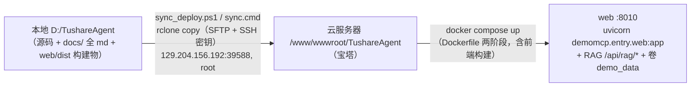

# 一键上传到云服务器（Rclone + SSH 密钥）

把本仓库整个项目文件夹上传到云服务器 `129.204.156.192:39588` 的 `/www/wwwroot/TushareAgent`，做到**一键、可重复、免密**。

> 为什么不是 rsync：本地（Windows/Git Bash）没有 rsync，`winget` 也没有干净的 rsync 包。改用等价的 **Rclone**（`rclone copy` 走 SFTP/SSH，同样支持增量、排除、非标准端口），传输层是同一套 SSH。

---

## 一、前置条件

- Windows + `ssh`（OpenSSH 10.x，Git Bash 已自带）。无需装 `sshpass`（用密钥免密）。
- 服务器 `129.204.156.192` 的 `39588` 端口开放 SSH，`root` 可登录（宝塔默认）。
- 首次需要**一次**服务器密码（用于把公钥写入服务器），之后全程免密。

## 二、文件说明

| 文件 | 作用 |
| --- | --- |
| `scripts/sync_deploy.ps1` | 主脚本。默认增量上传；`-Setup` 一次性引导；`-Mirror` 镜像；`-DryRun` 演练；`-Check` 联通自检 |
| `sync.cmd` | 根目录双击启动器，等同「不带参数」运行主脚本 |

## 三、一次性引导（只在首次）

```powershell
# 在项目根（D:\TushareAgent）执行
.\scripts\sync_deploy.ps1 -Setup
```

它会依次做四件事：

1. **装 Rclone**（若 PATH 无 `rclone`）：`winget install --id Rclone.Rclone`，并回探 `rclone.exe`（winget 新装通常不刷新当前进程 PATH，脚本里已处理；若仍未找到，重开一个终端再跑一次）。
2. **生成 SSH 密钥**（若 `%USERPROFILE%\.ssh\id_ed25519` 不存在）：`ssh-keygen -t ed25519`，空密码便于自动化。
3. **公钥写入服务器**（仅一次）：`ssh -o BatchMode=yes` 自检失败时才把公钥 append 到 `authorized_keys`，这里有一步**输一次服务器密码**。
4. **连通自检 + 建目录**：`ssh ... 'echo key-ok'` 通过 → `mkdir -p /www/wwwroot/TushareAgent` → 用 `rclone lsd` 列出 `/www/wwwroot` 确认可见。

**为什么先跑 `-Setup`**：它会用 `ssh -o StrictHostKeyChecking=accept-new` 把服务器 host key 写入 `%USERPROFILE%\.ssh\known_hosts`，Rclone 复读同一份 known_hosts，所以后续 `rclone` 才不会弹「是否信任此主机」；也把公钥装好，后续才免密。

## 四、日常上传（一键）

部署链路总览：



```powershell
# 方法 A：双击根目录 sync.cmd
# 方法 B：命令行
.\scripts\sync_deploy.ps1
```

> 上线前先跑一次 `.\scripts\sync_deploy.ps1 -DryRun` 核对清单：`docs\` 下 5 个 md 与 `web\dist\` 构建物应在传输列表内（见 §六 2、3）。

默认即 `rclone copy`（**只增不删**），只上传/覆盖本地有而服务器缺失或已变更的文件，重复跑很快（增量）。完成后打印 `Transferred:` 统计。全程免密。

### 其它模式

```powershell
.\scripts\sync_deploy.ps1 -DryRun    # 演练：只列出将要传的文件，不真传
.\scripts\sync_deploy.ps1 -Mirror    # 镜像同步（sync --delete）—— 会删服务器上本地没有的文件，慎用
.\scripts\sync_deploy.ps1 -Check     # 仅做免密自检并列出远端目录（验证用）
```

## 五、配置项（`scripts/sync_deploy.ps1` 顶部）

| 变量 | 默认值 | 说明 |
| --- | --- | --- |
| `$HOST` | `129.204.156.192` | 服务器 IP |
| `$PORT` | `39588` | 非标准 SSH 端口 |
| `$USER` | `root` | SSH 登录用户（宝塔默认 root 可登录） |
| `$KEY` | `%USERPROFILE%\.ssh\id_ed25519` | 私钥路径 |
| `$LOCAL` | `D:\TushareAgent` | 本地源码目录 |
| `$REMOTE` | `/www/wwwroot/TushareAgent` | 远端绝对路径（前导 `/` 表绝对） |
| `$UseExcludes` | `$false` | `$true` 时启用排除集合（默认全量） |
| `$Excludes` | `.venv/**`、`web/node_modules/**`、`web/dist/**`、`.git/**`、`__pycache__/**`、`.pytest_cache/**`、`.ruff_cache/**`、`*.egg-info/**`、`demo.db`、`*.log` | 排除项（与脚本逐字核对） |

## 六、注意事项 🔥

1. **默认是「字面全量」，会把 `.env`（含 `DS_API_KEY` / Tushare token）一起传到服务器。**
   - 服务器通常也**需要**自己的 `.env`（连 Tushare 官方 MCP 的 token、DeepSeek key 等），所以这未必是坏事；但请确认服务器上的 `.env` 就是你想要的，避免把本地占位/测试值带过去。
   - 若不想把 `.env` 传过去：把 `$UseExcludes` 设为 `$true`，并把 `.env` 加进 `$Excludes`，服务器侧手动放一份正确的 `.env`。

2. **首次全量体积大**：`.venv` 约 765MB + `web/node_modules` + `web/dist` + `.git`，一次传完要花一些时间。`rclone copy` 增量，后续只传变更文件，很快。嫌大就开 `$UseExcludes` 只传源码，在服务器上用 `uv sync` / `npm ci && npm run build` 重建依赖——注意此时 `web/dist` 也被排除（服务器需重建前端），而 `docs\` 的 md **不受排除**、始终上传（README 的文档链接因此完好）；改了文档或前端后务必确认 `-DryRun` 列表中二者都在。

3. **Windows 编译的 `.venv` / `node_modules` 在 Linux 服务器上不可复用**（`.venv` 的 `pyvenv.cfg`、`Scripts\*.exe` 都是 Windows 的）。全量传过去只是「一份备份/提交」，真要用得在服务器重新构建。

4. **默认只用 `copy`，不会删服务器任何文件**，服务器已有内容（`data/`、日志、配置、以及服务器生成的 `demo.db`）都保留。只有 `-Mirror` 才会 `sync --delete`，**会删除服务器上本地没有的文件**——只有确认「本地方为唯一真源」时才用。

5. **先跑 `-Setup` 再跑日常上传**：`-Setup` 会写 known_hosts + 装公钥，是免密和不弹「是否信任主机」的前提。跳过它的前置检查（`-Check` / 普通上传）会发现免密不可用并提示。

6. **`$USER` 用 root**：宝塔 `/www/wwwroot` 通常归 root（或 www:www 组）所有，root 可直接写。若你部署必须用非 root 账户，把 `$USER` 改成对应账号，并确保其对 `/www/wwwroot/TushareAgent` 有读写权限。

7. **改服务器后本地同步会覆盖**：`rclone copy` 以本地为准，会覆盖服务器上同名文件。若两台机器都对同一文件做修改，注意别互相冲掉（默认只向上推，不会拉回）。

8. **`-Setup` 的密码输入只在第一步**：后续全部免密；若仍每次要密码，说明公钥未被服务器接受，重新看过 `-Setup` 输出或手动 `cat ~/.ssh/authorized_keys` 检查。

## 七、排障

- **`SSH 免密自检失败`**：确认 `root@129.204.156.192` 允许 SSH 登录、`39588` 端口通、公钥已写入 `authorized_keys`（可用 `ssh -v` 看是否走 `key` 而非 `password`）。
- **`未找到 rclone`**：`winget install --id Rclone.Rclone` 后重开终端；或手动确认 `rclone.exe` 是否在 `%LOCALAPPDATA%\Microsoft\WinGet\Links`。
- **rclone 弹「是否信任主机」**：说明没先跑过 `-Setup`，或 known_hosts 没写入；先跑一次 `-Setup`。
- **`/www/wwwroot/TushareAgent` 无法写入**：`$USER` 是否有权限；root 可写，普通用户需 `chown` / `chmod`。
- **目录列表为空/不全**：确认 `$REMOTE` 前导 `/`；用 `rclone lsd "...:/www/wwwroot"` 看父目录是否可见。
